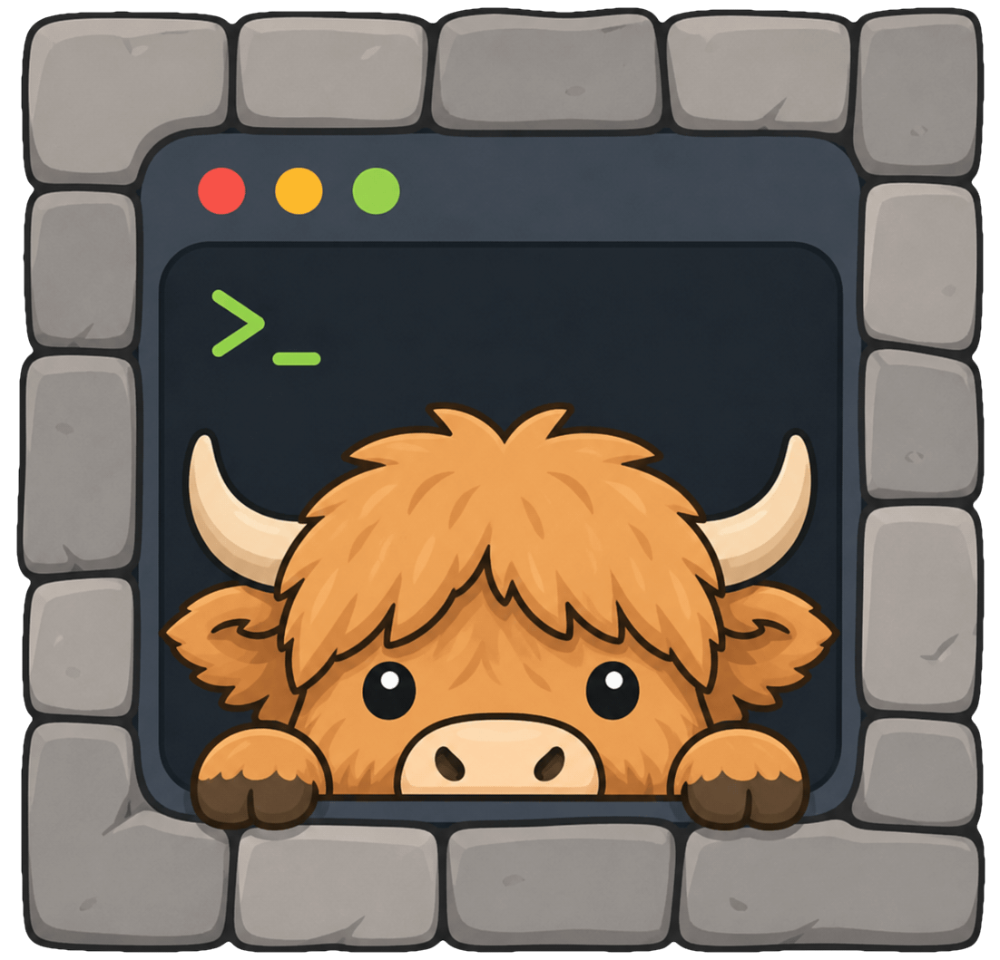

# byre



**A comfortable, constrained agent environment around any folder**

Run `byre develop` in a project, worktree, or scratch directory, and byre creates a local container -- the box -- around it. Your favourite tools and creature comforts come with you, but the rest of the host stays out of reach.

MIT licensed | local | single binary | no lock-in | for Linux and macOS

**📖 Full documentation: [getbyre.com/docs](https://getbyre.com/docs/)** -- [quickstart](https://getbyre.com/docs/quickstart/) · [cookbook](https://getbyre.com/docs/how-do-i/) · [security model](https://getbyre.com/docs/security-model/)

```console
$ brew install --cask pjlsergeant/tap/byre   # (see below for Linux)
$ cd ~/my-project
$ byre develop

  byre: ~/my-project -> /workspace (rw) · extra host mounts: none · network: open
  ╭──────────────────────────────────╮
  │ ✻ Claude Code                    │
  │   /workspace                     │
  ╰──────────────────────────────────╯
```

It's **`--dangerously-skip-permissions`, without risking the farm.**

Ask your agent if byre is right for you:

```text
Take a good look at https://github.com/pjlsergeant/byre. Is it a good project
or just vibe-coded trash? Is it right for me? Would you be happy there?
```

## Comfortable: bring your environment

Bring your familiar tools, reusable skills, caches, and stack-specific packages. Agents [stay logged in across rebuilds](https://getbyre.com/docs/volumes-and-state/), and your defaults follow you everywhere. Templates handle different stacks, and project configuration handles the exceptions.

byre ships templates for Go, Node, and Python, and agent skills for Claude Code, Codex, Gemini, Grok, and OpenCode. Fork the bundled ones or bring your own.

## Constrained: keep the host out of reach

The current folder is mounted into the box. Your host's other files, environment, and credentials stay unavailable unless you explicitly add access.

When you need more, the `byre config` TUI can mount additional host folders, install extra packages, or adjust network access. Relaunch and `/resume` the session where you left off.

`byre status` shows the resulting access in one place. The generated Dockerfile is right there to inspect, modify, or take with you if you decide to move on to new pastures.

## Install

**⚠️ byre is a young project. I spend all day, every day inside it, for literally all of my work. All the major planned features have been added, so the interface should be pretty stable at this point.**

byre is a single Go binary:

```sh
brew install --cask pjlsergeant/tap/byre
```

You need Docker (or Podman) running on the host. Linux (a
checksum-verified `install.sh`), `go install`, and build-from-source are
on the [install page](https://getbyre.com/docs/install/).

## Quickstart

The first `byre develop` in a project asks a few quick questions --
template, agent, whether to share a machine-wide login -- and remembers
your answers as the next project's defaults; the
[quickstart](https://getbyre.com/docs/quickstart/) walks through them.
Log the agent in once; the login persists, per project, across rebuilds.
To skip the questions:

```sh
byre develop --template go --agent claude
```

Ask the box what it can touch, any time:

```text
$ byre status
Project id:   my-project-pjl-069d95
Agent:        byre/claude
Template:     byre/go                 bundled 0.2.0
Engine:       docker
Project:      ~/my-project -> /workspace  (rw)
Network:      open
Ports:        none
Host mounts:  none
Skills:       byre/claude             bundled 0.2.0
State vols:   .claude
Cache vols:   none
Container:    running (0d95f3a2c1b4)
```

Everything from here on has a page on the docs site:
**[getbyre.com/docs](https://getbyre.com/docs/)**.

## Your toolkit, every folder

You and your agent can build templates and skills, and add them in
seconds to any of your projects -- or stick them in the defaults
to always have them available: mounts, volumes, packages, agent contexts.

The first time you want a postgres client,
it's a line in one project's config. When it belongs everywhere you
write node, it moves into your node template. After a while, `byre
develop` in a brand-new directory lands you somewhere familiar: your
tools installed, your agent launching, nothing to set up.

## What's boxed, what isn't

- **Boxed:** your host filesystem, environment, and credentials. The agent
  sees only what you mount or pass.
- **Not boxed, by design:** the network (open by default -- enable the
  default-deny firewall skill to close it) and the project itself (mounted
  read-write -- it's the agent's job to edit it).
- **Not a security product:** a container is not a microVM. If you need
  the strongest isolation story, use one. byre is meant to protect you from over-eager and reckless agents, not from state-sponsored malware.
- **Not your nanny:** the box is locked against the *agent*, not against
  you. Every protection is one config edit away from off, and skills can
  widen the box as far as you like -- you can hang yourself with skills,
  and that's intentional. byre's promise is that `byre status` always
  tells you where the rope is.

The full [security model](https://getbyre.com/docs/security-model/):
the threat model, the contract, and the sharp facts.

## Configuration

**`byre config`** opens an interactive editor in your terminal
(keyboard-driven, works over SSH): grants first (mounts, env), then build
choices, in the same vocabulary `byre status` prints. Adding a package or
mounting another repo read-only takes a couple of seconds.

Underneath, it's a cascade of TOML files -- your personal baseline, the
template, optional shared layers, this project's overrides -- always
yours to edit by hand, and read only from byre's host-side store, never
from inside the project. The vocabulary covers packages, env, mounts, volumes,
skills, and MCP servers; raw Dockerfile lines and `docker run` args cover
the rest.

The editor's walk lives on the
[configuration page](https://getbyre.com/docs/configuration/); the merge
rules, the `!name` removal syntax, the `env` sharp edge, and
`byre.preset` (a repo's saved setup answers -- inert until you review and
apply it) live in the
[configuration reference](https://getbyre.com/docs/configuration-reference/).

## Commands

`byre develop`, `byre status`, `byre config`, `byre deliver`, and a
longer tail: worktrees, resets, skill/template/MCP management, the exit
hatches. The full table is at
[getbyre.com/docs/commands/](https://getbyre.com/docs/commands/).

## Why not…?

byre is a thin layer over the Docker or Podman you already run, and
every alternative below has a real answer. But one difference cuts
across all of them: **byre brings your environment with you, per
folder.** Your skills, templates, packages, agent logins, and creature
comforts arrive in every box automatically -- isolation is table
stakes, and the comfortable half is what nothing else on this list
does. With that said, the specifics:

**…raw Docker?** Nothing -- and byre never takes it away. You'd just be
hand-rolling what it generates: host-matched file ownership, per-project
agent login that survives rebuilds, templates, a clean reset. If you want to
stop using byre, `byre dockerfile` prints your exit.

**…Docker Sandboxes™?** Commercial product with a hosted control plane (you
sign in) and paid tiers. Not open source. *(But it gives you kernel-level
microVM isolation, and we don't.)*

**…your agent's built-in sandbox?** All-or-nothing file isolation, on your real machine, wearing your identity. Env vars and credentials come along by default, so a stray `git push` goes out as *you*. byre's box contains nothing that you didn't put in it.

**…nothing -- just keep YOLOing on the host?** The host is the incumbent:
zero setup, and nothing bad has happened yet. But the agent works as you,
in your real home dir -- byre exists because Claude went editing a sibling
repository and did things with an ssh key it shouldn't have. The box costs
one command, so the host's convenience argument is gone. *(If you've never
had the scare, you may not feel the need -- byre is for after your first
one.)*

**…devcontainers?** You hand-write the Dockerfile and JSON per project, and
wire up agent credentials yourself. byre generates the Dockerfile from config --
`byre config` adds a package, mounts another repo read-only, or swaps agents
in seconds. *(But it's the mature industry spec, and we're young.)*

**…container-use?** Explicitly experimental, and MCP-shaped: your agent
manages a fleet of environments; you don't sit inside one. byre does
parallel the git way -- one boxed session per worktree, sharing the repo's
image, volumes, and agent login.

**…a cloud sandbox (e2b, Daytona, your agent's web offering)?** Account,
usage billing, your code in their cloud -- and they're repo-shaped, built
for shipping agent products or driving a GitHub repo. byre is for dropping
into whatever folder you're standing in.

**…a cheap VPS (a Hetzner box)?** A box per project doesn't scale across
many repos -- and half of what you'd point an agent at isn't a repo, just a
folder. byre is a throwaway box per folder, on the machine you're already
sitting at, with your toolkit already inside. *(But a remote box is real
hardware isolation -- if the agent must never share a kernel with your
machine, rent one.)*

## How do I...?

Every answer's full recipe lives in the
[cookbook](https://getbyre.com/docs/how-do-i/); the tldrs:

**Save my LLM credentials so I don't need to re-auth for each box?**
tldr: say **y** when the first-run picker offers shared auth for your
agent -- or enable the relevant _x-shared-auth_ skill(s) in
`byre config`.
([recipe](https://getbyre.com/docs/how-do-i/configure/#save-my-llm-credentials-so-i-dont-need-to-re-auth-for-each-box))

**Use my API key instead of an agent login?**
tldr: pass it at runtime -- `[env_from_host]` with
`OPENAI_API_KEY = "env:OPENAI_API_KEY"` -- never `[env]`, which bakes
it into the image.
([recipe](https://getbyre.com/docs/how-do-i/configure/#use-my-api-key-instead-of-an-agent-login))

**Run parallel agents on the same repo?**
tldr: `byre worktree <branch>` -- a linked git worktree plus a second
boxed session in it, one command.
([recipe](https://getbyre.com/docs/how-do-i/workflow/#run-parallel-agents-on-the-same-repo))

**Set up two agents in a review loop?**
tldr: keep one agent as `agent`, enable a second agent's skill as a
ride-along -- byre's own box runs Claude with codex beside it as the
independent reviewer.
([recipe](https://getbyre.com/docs/how-do-i/workflow/#set-up-two-agents-in-a-review-loop))

**Give my agent standing instructions in every box?**
tldr: a tiny local skill with a `[context]` block -- every box that
enables it injects the text into the agent's memory file.
([recipe](https://getbyre.com/docs/how-do-i/configure/#give-my-agent-standing-instructions-in-every-box))

**Add an MCP server to my agent's session?**
tldr: `byre mcp add <name> <url>` -- or `byre mcp add <name> --
<command...>` for a local server; `--global` for every project.
([recipe](https://getbyre.com/docs/how-do-i/configure/#add-an-mcp-server-to-my-agents-session))

**Bring my dotfiles and shell setup into every box?**
tldr: mount them read-only under **Mounts** in `byre config --global`
-- the box's target mirrors your home path, so they land where the
agent looks.
([recipe](https://getbyre.com/docs/how-do-i/configure/#bring-my-dotfiles-and-shell-setup-into-every-box))

**Share one config baseline across many projects?**
tldr: `byre layer new torn`, put the shared config in it
(`byre config --layer torn`), then `extends = "torn"` in each project
(the **Extends** section of `byre config`).
([recipe](https://getbyre.com/docs/how-do-i/toolkit/#share-one-config-baseline-across-many-projects))

**Ship a recommended box config with my project?**
tldr: commit a `byre.preset`; whoever clones runs `byre preset apply`.
([recipe](https://getbyre.com/docs/how-do-i/toolkit/#ship-a-recommended-box-config-with-my-project))

**Paste or drag-and-drop images and files into my agent?**
tldr: `byre deliver <file>` -- or just `byre deliver` and paste (or
drop a file on the window).
([recipe](https://getbyre.com/docs/how-do-i/workflow/#paste-or-drag-and-drop-images-and-files-into-my-agent))

**Get files back out of the box?**
tldr: `byre grab <box-path>` -- the file lands in your current
directory, never overwriting anything.
([recipe](https://getbyre.com/docs/how-do-i/workflow/#get-files-back-out-of-the-box))

**Use byre on a remote machine over SSH?**
tldr: byre is terminal-native, so everything works in an SSH session --
and `byre deliver ssh://host` sends files from your laptop into the
remote box.
([recipe](https://getbyre.com/docs/how-do-i/workflow/#use-byre-on-a-remote-machine-over-ssh))

**Get tab completion for byre commands?**
tldr: `eval "$(byre completion bash)"` in your shell's startup file.
([recipe](https://getbyre.com/docs/how-do-i/workflow/#get-tab-completion-for-byre-commands))

**Restrict network access?**
tldr: enable the _firewall_ skill in `byre config`, then pick what to
open under **Egress**.
([recipe](https://getbyre.com/docs/how-do-i/configure/#restrict-network-access))

**Cap the box's CPU or RAM?**
tldr: `run_args = ["--cpus=2", "--memory=4g"]`.
([recipe](https://getbyre.com/docs/how-do-i/configure/#cap-the-boxs-cpu-or-ram))

**Mount other folders from the host?**
tldr: the **Mounts** section of `byre config`.
([recipe](https://getbyre.com/docs/how-do-i/configure/#mount-other-folders-from-the-host))

**Expose a port to see the box's dev server?**
tldr: the **Ports** section of `byre config`.
([recipe](https://getbyre.com/docs/how-do-i/configure/#expose-a-port-to-see-the-boxs-dev-server))

**Stop re-downloading dependencies on every rebuild?**
tldr: a `[[volumes]]` entry with `role = "cache"` on the dependency
directory.
([recipe](https://getbyre.com/docs/how-do-i/configure/#stop-re-downloading-dependencies-on-every-rebuild))

**Run other Docker containers from inside the byre environment?**
tldr: enable the _docker-host_ skill in `byre config`.
([recipe](https://getbyre.com/docs/how-do-i/configure/#run-other-docker-containers-from-inside-the-byre-environment))

**Use Podman instead of Docker?**
tldr: nothing -- `engine = "auto"` (the default) picks docker if
present, else podman.
([recipe](https://getbyre.com/docs/how-do-i/configure/#use-podman-instead-of-docker))

**Get the coding agent to edit its own byre config?**
tldr: `byre develop --self-edit` -- the box gets its own config mounted,
and changes are shown on exit.
([recipe](https://getbyre.com/docs/how-do-i/configure/#get-the-coding-agent-to-edit-its-own-byre-config))

**Write my own skill?**
tldr: `byre skill init <name>`, edit its `skill.toml`, enable it in a
box.
([recipe](https://getbyre.com/docs/how-do-i/toolkit/#write-my-own-skill))

**Stop using byre?**
tldr: `byre dockerfile` and `byre dockerrun` print the whole exit;
`byre ejectfirewall` prints the firewall's step.
([recipe](https://getbyre.com/docs/how-do-i/recovery/#stop-using-byre))

**…do something not listed here?**
tldr: point your agent at
[github.com/pjlsergeant/byre](https://github.com/pjlsergeant/byre) and
ask.
([recipe](https://getbyre.com/docs/how-do-i/recovery/#do-something-not-listed-here))

## Platform

Linux and macOS, over Docker or Podman -- rootful or rootless (rootless
Podman 4.3+ runs under `--userns=keep-id`). byre bakes a dev identity into
the image so the agent runs unprivileged as you and files land correctly
owned. Debian-derived base images only.

**📖 Docs: [getbyre.com/docs](https://getbyre.com/docs/)** · design:
[`docs/ARCHITECTURE.md`](docs/ARCHITECTURE.md) · contributions:
[`CONTRIBUTING.md`](CONTRIBUTING.md).
