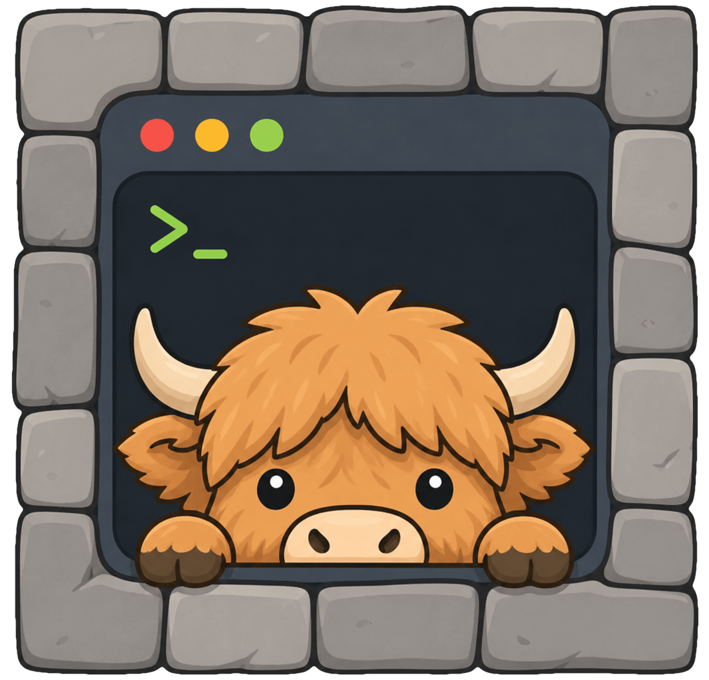

# byre



**A comfortable, constrained agent environment around any folder**

Run `byre develop` in a project, worktree, or scratch directory, and byre creates a local container -- the box -- around it. Your favourite tools and creature comforts come with you, but the rest of the host stays out of reach.

MIT licensed | open source | local | single binary | no lock-in | for Linux and macOS

**📖 Full documentation: [getbyre.com/docs](https://getbyre.com/docs/)** -- [quickstart](https://getbyre.com/docs/quickstart/) · [configuration](https://getbyre.com/docs/configuration/) · [cookbook](https://getbyre.com/docs/how-do-i/) · [security model](https://getbyre.com/docs/security-model/)

```console
$ brew install --cask pjlsergeant/tap/byre   # (see below for Linux)
$ cd ~/my-project
$ byre develop

  byre: exposure: /workspace rw · 10 env vars
  byre: network open
  ╭──────────────────────────────────╮
  │ ✻ Claude Code                    │
  │   /workspace                     │
  ╰──────────────────────────────────╯
```

It's **`--dangerously-skip-permissions`, without risking the farm.**

Every box opens familiar: your tools installed, your defaults applied, your agent's login persisting, per project, across rebuilds.

Ask your agent if byre is right for you:

```text
Take a good look at https://github.com/pjlsergeant/byre. Is it a good project
or just vibe-coded trash? Is it right for me? Would you be happy there?
```

## Comfortable: bring your environment

Bring your familiar tools, reusable skills, caches, and stack-specific packages. Agents [stay logged in, per project, across rebuilds](https://getbyre.com/docs/volumes-and-state/), and your defaults follow you everywhere. Templates handle different stacks, and project configuration handles the exceptions.

byre ships templates for Go, Node, and Python, and agent skills for Claude Code, Codex, Gemini, Grok, and OpenCode. Fork the bundled ones or bring your own: you and your agent can build templates and skills, add them in seconds to any of your projects, or stick them in the defaults to always have them available: mounts, volumes, packages, agent contexts.

The first time you want a postgres client, it's a line in one project's config. When it belongs everywhere you write node, it moves into your node template. After a while, `byre develop` in a brand-new directory lands you somewhere familiar: your tools installed, your agent launching, nothing to set up.

## Change the box in seconds

`byre config` opens a keyboard-driven editor over the whole box (it works over SSH), in the same vocabulary `byre status` prints:

```text
byre project config  (client-api-pjl-3bbe8c)
exposure: 1 host mount · 11 env vars · network deny-by-default · egress 7 hosts

─ GRANTS — what this box can reach ─────────────────────────
▸ Extra mounts      : 1 mount  (enter to edit)
  Ports             : (none)
  Egress            : 7 hosts  (7 from skills)  — 11 offered
  Env vars          : 11 vars  (6 inherited, 5 from skills)

─ BUILD — how the box is made ──────────────────────────────
  Template          : [go] [node] [python] [none]
  Agent             : [claude] [codex] [gemini] [grok] [opencode] [none]
  Packages          : 2 packages
  Skills            : 3 enabled
  MCP servers       : (none)
  Instructions      : 1 snippet
··· (more below)

↑↓ move · ←→ change · ↵ open · ^s save · ^e $EDITOR · ^q quit
```

One client's projects need their own standing instructions? Keep them in a shared layer and point each of that client's projects at it. Want ripgrep in just this box? Add the package and rebuild. The agent needs a sibling repo? Mount it read-only. Each is a couple of seconds in `byre config`, then relaunch and `/resume` where you left off.

And if you want to live dangerously: `byre develop --self-edit` hands the agent its own box config, and what it changed is shown when you leave.

Underneath, it's a cascade of TOML files -- your personal baseline, the template, optional shared layers, this project's overrides -- read only from byre's host-side store, never from inside the project. The editor is the interface: no byre feature ever requires you to open those files yourself. They stay plain TOML so they're diffable, shareable, and always yours to edit by hand if you prefer: a right, not a step in any recipe. The editor's walk lives on the [configuration page](https://getbyre.com/docs/configuration/); the merge rules, the `!name` removal syntax, the `env` sharp edge, and `byre.preset` (a repo's saved setup answers -- inert until you review and apply it) live in the [configuration reference](https://getbyre.com/docs/configuration-reference/).

## Constrained: keep the host out of reach

The current folder is mounted into the box. Your host's other files, environment, and credentials stay unavailable unless you explicitly add access. When you need more, grants are rows in the editor above: mounts, env vars, egress, ports.

`byre status` shows the resulting access in one place. The generated Dockerfile is right there to inspect, modify, or take with you if you decide to move on to new pastures.

## Install

byre is a young project -- read the [maturity note](https://getbyre.com/docs/install/) before you lean on it.

byre is a single Go binary:

```sh
brew install --cask pjlsergeant/tap/byre
```

You need Docker (or Podman) running on the host. Linux (a
checksum-verified `install.sh`), `go install`, and build-from-source are
on the [install page](https://getbyre.com/docs/install/).

## Quickstart

The first `byre develop` in a project asks a few quick questions --
template, agent, whether to share a machine-wide login -- and remembers
your answers as the next project's defaults; the
[quickstart](https://getbyre.com/docs/quickstart/) walks through them.
Log the agent in once; the login persists, per project, across rebuilds.
To skip the questions:

```sh
byre develop --template go --agent claude
```

Ask the box what it can touch, any time:

```text
$ byre status
Project id:   my-project-pjl-069d95
Agent:        byre/claude
Template:     byre/go      bundled v1.3.1
Engine:       docker
Project:      ~/my-project -> /workspace  (rw)
Image:        byre-my-project-pjl-069d95-u501-g20  (sha256:1f0b7c9d4e2a…
              (--full to show); base golang:1.26-bookworm)
Network:      open
Ports:        none
Host mounts:  none
Skills:       byre/claude  bundled v1.3.1
State vols:   .claude
Cache vols:   none
Box env:      10 keys the box received  (values never recorded; --full to show)
Container:    running (0d95f3a2c1b4)
              ↳ the grant rows above describe THIS box (launch record
              4c1e8a7b2d90). Other rows describe the current config.
```

Every row that exists is on that page -- long values are cut down and
each cut says so. `byre status --full` shows them whole; `byre status
--data` prints the same content as JSON.

Everything from here on has a page on the docs site:
**[getbyre.com/docs](https://getbyre.com/docs/)**.

## What's boxed, what isn't

Your host filesystem, environment, and credentials are boxed -- the agent
sees the project plus exactly what you grant. The network and the project
tree are open by design, and byre is deliberately neither a security
product nor your nanny. The contract in full:
[what's boxed, what isn't](https://getbyre.com/docs/whats-boxed/); the
threat model and sharp facts:
[security model](https://getbyre.com/docs/security-model/).

## Commands

`byre develop`, `byre status`, `byre config`, `byre deliver`, and a
longer tail: worktrees, resets, skill/template/MCP management, the exit
hatches. The full table is at
[getbyre.com/docs/commands/](https://getbyre.com/docs/commands/).

## Why not…?

Isolation is table stakes; the comfortable half is what nothing else
has. The honest comparisons -- raw Docker, Docker Sandboxes™,
devcontainers, your agent's built-in sandbox, a VPS, or staying on the
host -- concessions included:
[getbyre.com/why-not](https://getbyre.com/why-not/).

## How do I...?

Every answer's full recipe lives in the
[cookbook](https://getbyre.com/docs/how-do-i/); the tldrs:

**Save my LLM credentials so I don't need to re-auth for each box?**
tldr: say **y** when the first-run picker offers shared auth for your
agent -- or enable the relevant _x-shared-auth_ skill(s) in
`byre config`.
([recipe](https://getbyre.com/docs/how-do-i/configure/#save-my-llm-credentials-so-i-dont-need-to-re-auth-for-each-box))

**Use my API key instead of an agent login?**
tldr: pass it at runtime -- `[env_from_host]` with
`OPENAI_API_KEY = "env:OPENAI_API_KEY"` -- never `[env]`, which bakes
it into the image.
([recipe](https://getbyre.com/docs/how-do-i/configure/#use-my-api-key-instead-of-an-agent-login))

**Run parallel agents on the same repo?**
tldr: `byre worktree <branch>` -- a linked git worktree plus a second
boxed session in it, one command.
([recipe](https://getbyre.com/docs/how-do-i/workflow/#run-parallel-agents-on-the-same-repo))

**Set up two agents in a review loop?**
tldr: keep one agent as `agent`, enable a second agent's skill as a
ride-along -- byre's own box runs Claude with codex beside it as the
independent reviewer.
([recipe](https://getbyre.com/docs/how-do-i/workflow/#set-up-two-agents-in-a-review-loop))

**Give my agent standing instructions in every box?**
tldr: `byre context add house-rules` opens your $EDITOR -- `--global`
for every box on the machine, plain for just this project; also the
**Instructions** section of `byre config`.
([recipe](https://getbyre.com/docs/how-do-i/configure/#give-my-agent-standing-instructions-in-every-box))

**Add an MCP server to my agent's session?**
tldr: `byre mcp add <name> <url>` -- or `byre mcp add <name> --
<command...>` for a local server; `--global` for every project.
([recipe](https://getbyre.com/docs/how-do-i/configure/#add-an-mcp-server-to-my-agents-session))

**Bring my dotfiles and shell setup into every box?**
tldr: mount them read-only under **Mounts** in `byre config --global`
-- the box's target mirrors your home path, so they land where the
agent looks.
([recipe](https://getbyre.com/docs/how-do-i/configure/#bring-my-dotfiles-and-shell-setup-into-every-box))

**Share one config baseline across many projects?**
tldr: `byre layer new torn`, put the shared config in it
(`byre config --layer torn`), then `extends = "torn"` in each project
(the **Extends** section of `byre config`).
([recipe](https://getbyre.com/docs/how-do-i/toolkit/#share-one-config-baseline-across-many-projects))

**Ship a recommended box config with my project?**
tldr: commit a `byre.preset`; whoever clones runs `byre preset apply`.
([recipe](https://getbyre.com/docs/how-do-i/toolkit/#ship-a-recommended-box-config-with-my-project))

**Paste or drag-and-drop images and files into my agent?**
tldr: `byre deliver <file>` -- or just `byre deliver` and paste (or
drop a file on the window).
([recipe](https://getbyre.com/docs/how-do-i/workflow/#paste-or-drag-and-drop-images-and-files-into-my-agent))

**Get files back out of the box?**
tldr: `byre grab <box-path>` -- the file lands in your current
directory, never overwriting anything.
([recipe](https://getbyre.com/docs/how-do-i/workflow/#get-files-back-out-of-the-box))

**Use byre on a remote machine over SSH?**
tldr: byre is terminal-native, so everything works in an SSH session --
and `byre deliver ssh://host` sends files from your laptop into the
remote box.
([recipe](https://getbyre.com/docs/how-do-i/workflow/#use-byre-on-a-remote-machine-over-ssh))

**Get tab completion for byre commands?**
tldr: `eval "$(byre completion bash)"` in your shell's startup file.
([recipe](https://getbyre.com/docs/how-do-i/workflow/#get-tab-completion-for-byre-commands))

**Restrict network access?**
tldr: enable the _firewall_ skill in `byre config`, then pick what to
open under **Egress**.
([recipe](https://getbyre.com/docs/how-do-i/configure/#restrict-network-access))

**Cap the box's CPU or RAM?**
tldr: `run_args = ["--cpus=2", "--memory=4g"]`.
([recipe](https://getbyre.com/docs/how-do-i/configure/#cap-the-boxs-cpu-or-ram))

**Mount other folders from the host?**
tldr: the **Mounts** section of `byre config`.
([recipe](https://getbyre.com/docs/how-do-i/configure/#mount-other-folders-from-the-host))

**Expose a port to see the box's dev server?**
tldr: the **Ports** section of `byre config`.
([recipe](https://getbyre.com/docs/how-do-i/configure/#expose-a-port-to-see-the-boxs-dev-server))

**Stop re-downloading dependencies on every rebuild?**
tldr: a `[[volumes]]` entry with `role = "cache"` on the dependency
directory.
([recipe](https://getbyre.com/docs/how-do-i/configure/#stop-re-downloading-dependencies-on-every-rebuild))

**Run other Docker containers from inside the byre environment?**
tldr: enable the _docker-host_ skill in `byre config`.
([recipe](https://getbyre.com/docs/how-do-i/configure/#run-other-docker-containers-from-inside-the-byre-environment))

**Use Podman instead of Docker?**
tldr: nothing -- `engine = "auto"` (the default) picks docker if
present, else podman.
([recipe](https://getbyre.com/docs/how-do-i/configure/#use-podman-instead-of-docker))

**Get the coding agent to edit its own byre config?**
tldr: `byre develop --self-edit` -- the box gets its own config mounted,
and changes are shown on exit.
([recipe](https://getbyre.com/docs/how-do-i/configure/#get-the-coding-agent-to-edit-its-own-byre-config))

**Write my own skill?**
tldr: `byre skill init <name>`, edit its `skill.toml`, enable it in a
box.
([recipe](https://getbyre.com/docs/how-do-i/toolkit/#write-my-own-skill))

**Stop using byre?**
tldr: `byre dockerfile` and `byre dockerrun` print the whole exit;
`byre ejectfirewall` prints the firewall's step.
([recipe](https://getbyre.com/docs/how-do-i/recovery/#stop-using-byre))

**…do something not listed here?**
tldr: point your agent at
[github.com/pjlsergeant/byre](https://github.com/pjlsergeant/byre) and
ask.
([recipe](https://getbyre.com/docs/how-do-i/recovery/#do-something-not-listed-here))

## Platform

Linux and macOS, over Docker or Podman -- rootful, plus rootless **Podman**
4.3+, which byre detects and runs under `--userns=keep-id`. Rootless
*Docker* is not detected as rootless: byre gives it the rootful treatment,
so that is the identity story you get there. byre bakes a dev identity into
the image so the agent runs unprivileged as you and files land correctly
owned. Debian-derived base images only.

**📖 Docs: [getbyre.com/docs](https://getbyre.com/docs/)** · design:
[`docs/ARCHITECTURE.md`](docs/ARCHITECTURE.md) · contributions:
[`CONTRIBUTING.md`](CONTRIBUTING.md).
